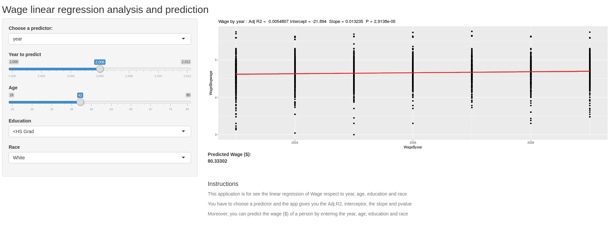

```{r setup, include=FALSE}
knitr::opts_chunk$set(echo = FALSE)
```


## Shiny Application

The name of the application is "Wage linear regression analysis and prediction".

This app uses the dataset Wage to show the linear regression of Wage. You can chose 
the predictor among Year, age, Education and race.

Moreover, you can predict the wage ($) of a person by entering the year, age, education and race.

## Description  

You can download the shiny application for this repository and run it from you R-Studio or you can
access through the shinyapp server using https://mcastrol.shinyapps.io/finalassigment/
Please, if you get an error, load again the page.

```{r, echo=FALSE, fig.cap="App user interface", out.width = '100%'}

```


## Instructions to run it 


You choose the type of predictor among the options: Year, Age, Education and Race, and the app shows you a plot with the regression line.
The graphic is done using this base function 
```{r,eval=FALSE, echo=TRUE}
ggplot(fit$model, aes_string(x = names(fit$model)[2], y = names(fit$model)[1])) + 
    geom_point() +
    stat_smooth(method = "lm", col = "red") +
    labs(title = paste("Wage by",predictor, ": Adj R2 = ",signif(summary(fit)$adj.r.squared, 5),
          "Intercept =",signif(fit$coef[[1]],5 ),
          " Slope =",signif(fit$coef[[2]], 5),
          " P =",signif(summary(fit)$coef[2,4], 5)))
```
If you input a year, age, education level and race, you obtain the wage in dolars of a person, 
calculated using a regresion linear model of the wage respect of year, ager, education and race.

##


```{r, echo=FALSE, out.width = '100%'}

```


